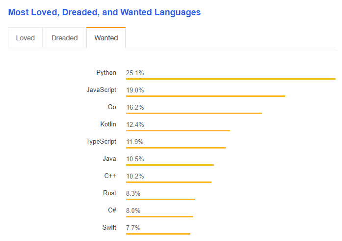
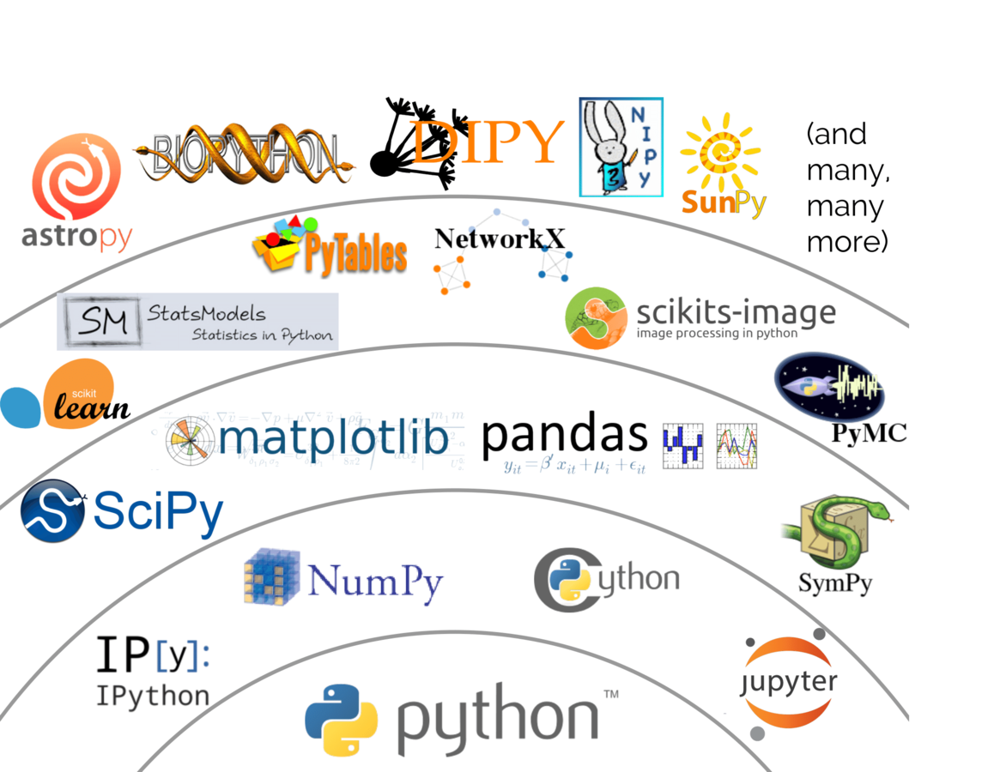
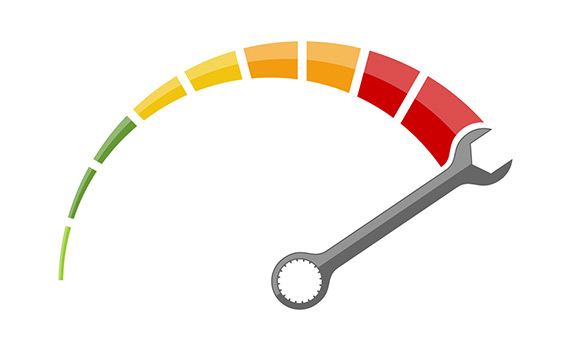

# Motivación

[Python](https://www.python.org/) es un lenguaje de programación interpretado, cuya filosofía hace hincapié en una sintaxis muy limpia y un código legible. Aquí les presento una lista de razones para aprender Python.

* Código abierto
* Multiparadigma y Multiplataforma
* Versatilidad a la hora de programar
* Sintaxis amigable

## Popularidad 

Desde 2012, Python ha crecido constantemente en popularidad, y es probable que la tendencia continúe, si no aumenta, en el futuro.

Según [Stack Overflow Developer Survey 2018](https://insights.stackoverflow.com/survey/2018/#most-loved-dreaded-and-wanted).

La demanda y el soporte para Python también están en aumento, y si se cree en las proyecciones, Python superará a Java en los próximos años y reclamará el primer puesto.

**¿Es buena la popularidad de Python?**

En general, lo que es popular no siempre es lo mejor, en el caso de los lenguajes de programación, la popularidad vale la pena.

Gracias a la popularidad de Python, es probable que encuentre una solución preparada para cualquier problema que pueda estar experimentando. La comunidad de entusiastas de Python es fuerte y están trabajando incansablemente para mejorar el lenguaje todos los días.

Python también tiene una serie de patrocinadores corporativos, presionando para popularizar aún más el lenguaje. Entre ellos se encuentran gigantes tecnológicos como [Google](https://www.google.com/), que está utilizando Python.

## Librerías y frameworks

Una gran ventaja de Python es la amplia selección de **librerías** y **frameworks** que ofrece. 

Hay librerías para distintos tópicos:

* Manipulación de datos 
* Visualización de datos 
* Aprendizaje automático
* Ciencia de los datos
* Procesamiento natural del lenguaje
* Big Data

Lo mismo es cierto para los `frameworks`, que ayudan a despegar su proyecto y le ahorran tiempo y esfuerzo. Hay una variedad de marcos para elegir, dependiendo de sus necesidades, por ejemplo, para el desarrollo web tenemos:

* Django
* Flask
* FastApi

## Performance

Una de las mayores críticas de Python es el tiempo de ejecución, relativamente lento en comparación con otros lenguajes. Sin embargo, hay una solución alternativa a este desafío específico.

Cuando el rendimiento tiene prioridad, Python le brinda la capacidad de integrar otros lenguajes de mayor rendimiento en su código. **Cython** es un buen ejemplo de tal solución. Optimiza su velocidad sin obligarlo a reescribir todo su código base desde cero.

El recurso más caro no es el tiempo de CPU, sino el tiempo de tus desarrolladores. Por lo tanto, reducir el tiempo de comercialización siempre debe tener prioridad sobre la ejecución rápida del tiempo de ejecución.

Además, Python tiene una sintaxis clara y no requiere tantas líneas de código como **Java** o **C** para obtener resultados comparables.

**¿Cuáles son los beneficios de la alta legibilidad de Python?**

La simplicidad de Python es particularmente útil para leer el código, el suyo o el de otra persona. Debido a que el código Python tiene menos líneas e imita el inglés, revisarlo lleva mucho menos tiempo. Este es un gran beneficio.

Reducir el tiempo que necesita dedicar a la revisión de código es invaluable, ya que la productividad de sus desarrolladores debe ser su máxima prioridad.

## Referencia

1. [Introducción al lenguaje Python](https://entrenamiento-python-basico.readthedocs.io/es/latest/leccion1/)
2. [Introducción — Tutorial de Python 3.6.3 documentation](http://docs.python.org.ar/tutorial/3/real-index.html)
